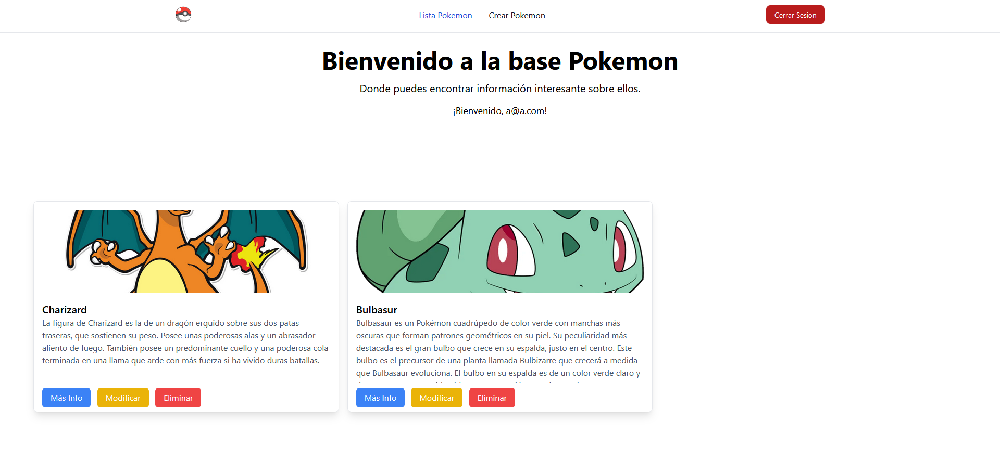
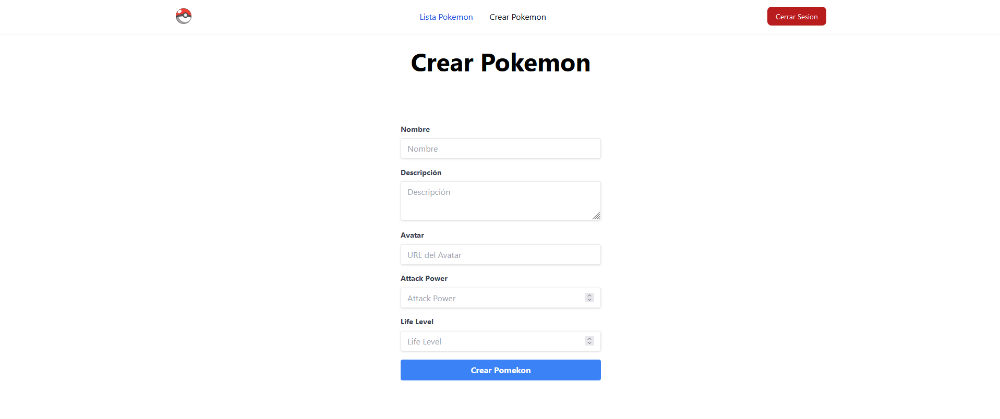
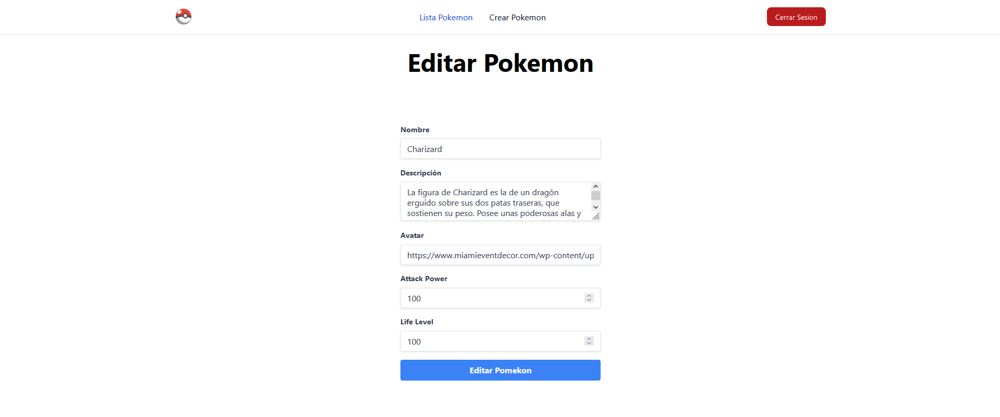
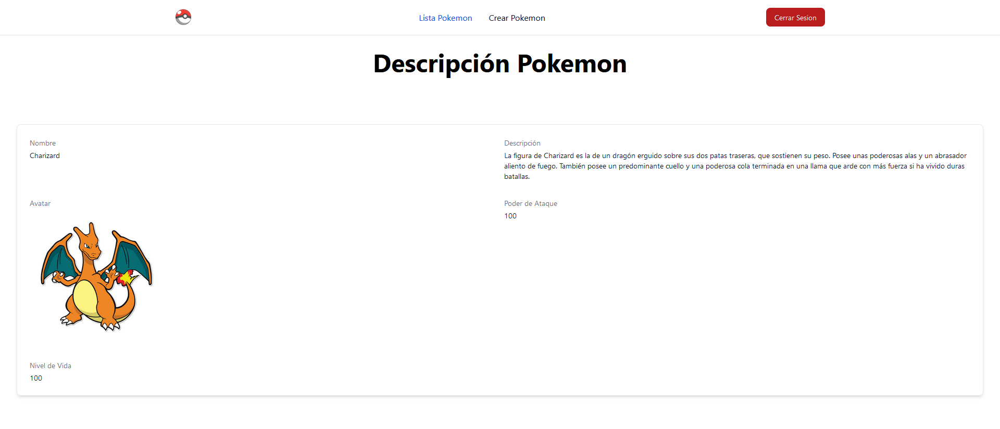

# Proyecto Pokémon

Este proyecto se centra en el desarrollo web y la programación en PHP. Aquí encontrarás los pasos y las funcionalidades necesarios para llevar a cabo este proyecto.

## Creación de la Base de Datos

- Crea una base de datos llamada "roleplay."
- Dentro de esta base de datos, crea una tabla llamada "Pokemon" con los siguientes campos:
    - `name`: Nombre del Pokémon.
    - `avatar`: URL del avatar del Pokémon.
    - `description`: Descripción del Pokémon.
    - `attack power`: Poder de ataque del Pokémon.
    - `life level`: Nivel de vida del Pokémon.

## Carga del Proyecto con la Plantilla Inicial

1. Abre el proyecto PHP, inicia sesion o registrate para mostrar la información sobre los Pokémon en la web.

2. La página de inicio del proyecto mostrará un listado de todos los Pokémon, con las siguientes funcionalidades:

### 1. Listado de Pokémon

- Por cada Pokémon mostraremos:
    - El nombre del Pokémon.
    - La URL del avatar del Pokémon en una etiqueta ``.
    - La descripción del Pokémon en una etiqueta `
`.
    - Un botón para mostrar el detalle del Pokémon.
    - Un botón para editar los campos del Pokémon.
    - Un botón para eliminar el Pokémon.

### 2. Crear un Pokémon

- En la barra de menú, habrá un enlace que permitirá crear un nuevo Pokémon. Al hacer clic en este enlace, el usuario será dirigido a una pantalla donde podrá ingresar los datos del nuevo Pokémon. Una vez se realice la inserción, se redirigirá automáticamente a la página del listado inicial.

### 3. Modificar Pokémon

- Al hacer clic en el botón de "editar" en la información de cada Pokémon, se cargará un formulario de edición con los datos de ese Pokémon. El usuario podrá modificar los campos y, al guardar los cambios, será redirigido nuevamente a la página del listado inicial.

### 4. Eliminar Pokémon

- El botón de "Exterminar" correspondiente a cada Pokémon permitirá eliminar ese Pokémon de la base de datos.

### 5. Detalle de Pokémon

- El botón "Más información" permitirá obtener un detalle de los campos del Pokémon, mostrados en una pantalla con información detallada sobre ese Pokémon.

